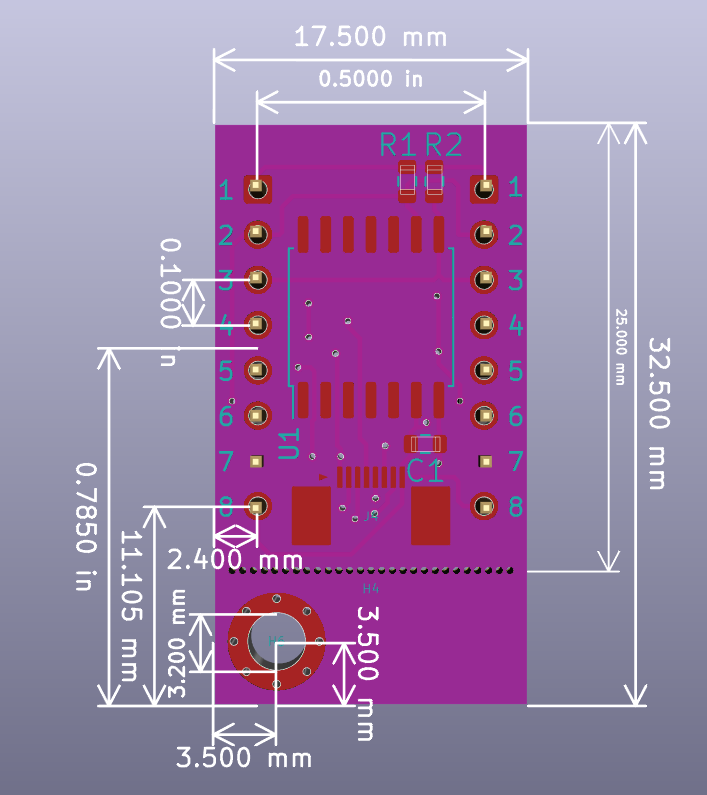

# NPA-7xx breakout board 

This board supports NPA-7xx series differential pressure sensors. 

## Board pinout 

1) VDD, 3.135 V to 3.465 V for NPA-730 series and 4.75 V to 5.25 V to NPA-700 series
2) PIN1 SCL
3) PIN2 SDA
4) PIN3 GPIO3 - Sensor version detect 1
5) PIN4 GPIO4 - Sensor version detect 2
6) PIN5 GPIO5 - Sensor version detect 3
7) PIN6 - NC, keying for assembly
8) GND

GPIO3 | GPIO4 | GPIO5 | Sensor
———————————————————————————
HI    | HI    | LO/NC | Reserved
LO/NC | HI    | LO/NC | NPA-7xx-030D 
HI    |LO/NC  | LO/NC | NPA-7xx-015D
LO/NC |LO/NC  | LO/NC | NPA-7xx-005D
HI    | HI    | LO/NC | NPA-7xx-001D
LO/NC | HI    | LO/NC | NPA-7xx-10WD
HI    |LO/NC  | LO/NC | NPA-7xx-05WD
LO/NC |LO/NC  | LO/NC | NPA-7xx-02WD

## Dimensions of expansion board

* Outline 17.5 x 32.5 mm (17.5 x 25 mm without mounting holes)
* Minimum drill 0.3 mm, annular 0.6 mm, trace 0.25 mm, isolation 0.15 mm.
* Any board thickness and plating.

## Exports
In addition to KiCAD source files, Gerbers and PDF export is available under exports of
each project folder.

## Versioning
Versions which begin with same letter (e.g. 'B') are interface-compatible: Their mounting holes
and signals are at the same places. Revisions might have internal changes, such as different routing or
component placement.

Versions which begin with different letter are not backward compatible, i.e. mounting holes or dimensions of board
may have changed. 

## Licenses

This board is based on [Ruuvi Connector board](https://github.com/ruuvi/connector) which is
CC BY-SA 4.0 licensed. 

Footprints are from 
 * [Ruuvi/KiCAD-library](https://www.ohwr.org/project/cernohl/wikis/uploads/8a6b5d01f71c207c49493e4d114d61e6/cern_ohl_p_v2_howto.pdf) 
which aren't licensed in any manner.
 * [ojousima.footprints.kicad](https://github.com/ojousima/ojousima.footprints.kicad/tree/0481a381fbb01a2b40545e94f72d81239064c85a) which is MIT-licensed.

A permission to publish this package under CERN-OHL-P has been requested, but not yet granted. In meanwhile, entire project inherits 
CC BY-SA from Ruuvi Connector design.
